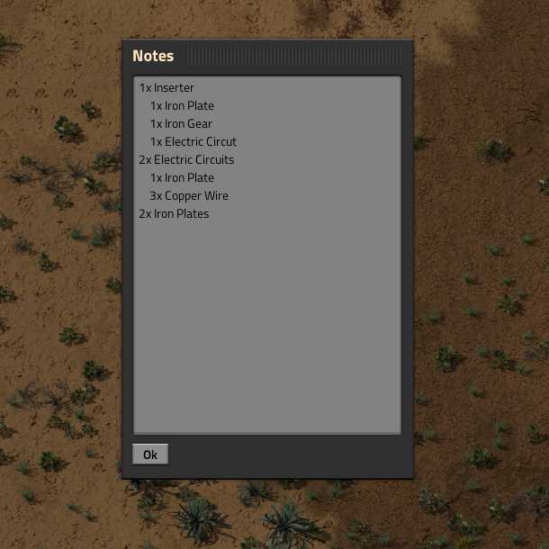

# Notes

A factorio mod for note taking.

# How to use

Press the N key to open the note GUI, or Shift + N to reset the window options for that GUI. These buttons can be changed in the controls menu.

The notes text and window options are saved per player by player name.
